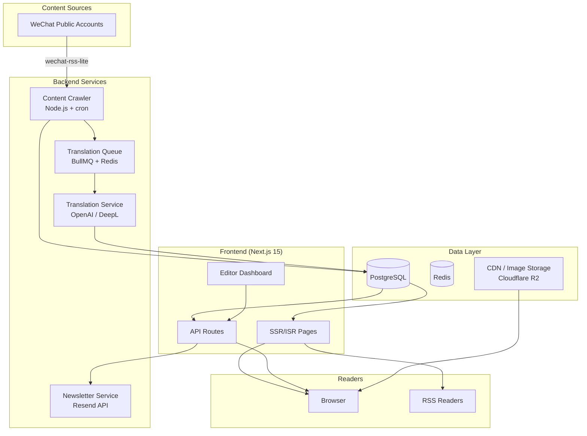
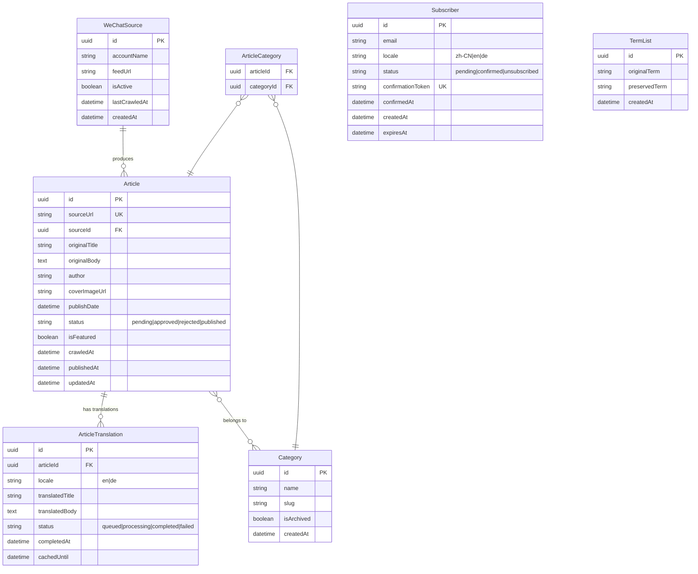

# Design Document: Chinese AI Startup News

## Overview

This design describes a multilingual news platform focused on Chinese AI startup stories, targeting global readers. The system crawls content from WeChat public accounts, translates it into English and German via AI, and presents it through a professional news media interface inspired by [Rest of World](https://restofworld.org).

### Key Design Decisions

1. **Framework Migration: Vite+React → Next.js 15 (App Router)** — The current Vite SPA cannot meet SSR/SSG/ISR requirements. Next.js provides built-in SSR, ISR, locale-based routing, and image optimization out of the box.

2. **i18n Strategy: Folder-based routing with `next-intl`** — URL structure `/[locale]/...` (e.g., `/en/article/slug`, `/de/article/slug`, `/zh/article/slug`) provides SEO-friendly locale paths and clean separation.

3. **Database: PostgreSQL with Prisma ORM** — Relational data (articles, categories, translations, subscriptions) fits naturally into a relational model. Prisma provides type-safe queries and migration management.

4. **Translation Provider: OpenAI GPT-4o API** — High-quality multilingual translation with term preservation capabilities. Fallback to DeepL API for reliability.

5. **Content Crawler: Node.js service using wechat-rss-lite** — Runs as a background cron job, fetching RSS feeds from configured WeChat public accounts.

6. **Deployment: Vercel (frontend) + Railway/Fly.io (backend services)** — Vercel handles Next.js SSR/ISR natively. Background services (crawler, translation queue) run on a separate compute platform.

## Architecture

### System Architecture Diagram



### Data Flow

1. **Ingestion**: Crawler fetches articles from WeChat → stores in DB with `pending` status
2. **Review**: Editor approves/rejects via dashboard → approved articles trigger translation
3. **Translation**: BullMQ job processes translation → stores translated content in DB
4. **Publishing**: ISR regenerates static pages → readers see updated content
5. **Newsletter**: Weekly cron job compiles digest → sends via Resend API

## Components and Interfaces

### 1. Content Crawler Service

```typescript
interface CrawlerConfig {
  sources: WeChatsource[];
  intervalMinutes: number; // 15-1440, default 60
  retryAttempts: number;   // default 3
  retryDelayMinutes: number; // default 5
}

interface WeChatSource {
  id: string;
  accountName: string;
  feedUrl: string;
  isActive: boolean;
  lastCrawledAt: Date | null;
}

interface CrawlResult {
  sourceId: string;
  articlesFound: number;
  articlesIngested: number;
  duplicatesSkipped: number;
  errors: CrawlError[];
}

interface CrawlError {
  sourceId: string;
  message: string;
  attemptNumber: number;
  timestamp: Date;
}
```

**Responsibilities:**
- Scheduled fetching via node-cron
- Deduplication by source URL
- Retry logic with exponential backoff
- Error notification to editors
- Source management (add/remove/disable)

### 2. Translation Service

```typescript
interface TranslationRequest {
  articleId: string;
  sourceText: string;
  sourceLocale: 'zh-CN';
  targetLocale: 'en' | 'de';
  termList: TermEntry[];
}

interface TermEntry {
  original: string;    // Chinese term
  preserved: string;   // Keep as-is in translation
}

interface TranslationResult {
  articleId: string;
  targetLocale: string;
  translatedTitle: string;
  translatedBody: string;  // Preserves HTML structure
  completedAt: Date;
  provider: 'openai' | 'deepl';
}

interface TranslationJob {
  id: string;
  articleId: string;
  status: 'queued' | 'processing' | 'completed' | 'failed';
  targetLocales: string[];
  createdAt: Date;
  completedAt: Date | null;
  error: string | null;
}
```

**Responsibilities:**
- Queue-based processing via BullMQ
- Preserve formatting (headings, lists, links, images)
- Term list management for proper nouns/brands
- Timeout handling (60s per article)
- Fallback from OpenAI to DeepL on failure
- Re-translation on article update

### 3. Newsletter Service

```typescript
interface Subscriber {
  id: string;
  email: string;
  locale: 'zh-CN' | 'en' | 'de';
  status: 'pending' | 'confirmed' | 'unsubscribed';
  confirmationToken: string;
  confirmedAt: Date | null;
  createdAt: Date;
}

interface NewsletterDigest {
  id: string;
  locale: string;
  articles: ArticleSummary[];
  sentAt: Date;
  recipientCount: number;
}

interface SubscriptionAPI {
  subscribe(email: string, locale: string): Promise<{ success: boolean }>;
  confirm(token: string): Promise<{ success: boolean }>;
  unsubscribe(token: string): Promise<{ success: boolean }>;
  sendWeeklyDigest(): Promise<NewsletterDigest[]>;
}
```

**Responsibilities:**
- Double opt-in confirmation flow
- Language-specific subscription lists
- Weekly digest compilation and sending
- Unsubscribe handling
- Duplicate detection
- 48-hour confirmation expiry

### 4. Frontend Application (Next.js 15 App Router)

```
app/
├── [locale]/
│   ├── layout.tsx              # Locale-aware layout with nav
│   ├── page.tsx                # Homepage
│   ├── article/
│   │   └── [slug]/
│   │       └── page.tsx        # Article detail (ISR)
│   ├── category/
│   │   └── [slug]/
│   │       └── page.tsx        # Category listing (ISR)
│   ├── latest/
│   │   └── page.tsx            # Latest articles
│   ├── search/
│   │   └── page.tsx            # Search results
│   ├── about/
│   │   └── page.tsx            # About page
│   └── newsletter/
│       ├── page.tsx            # Newsletter page
│       ├── confirm/
│       │   └── page.tsx        # Confirmation handler
│       └── unsubscribe/
│           └── page.tsx        # Unsubscribe handler
├── editor/
│   ├── layout.tsx              # Editor dashboard layout (auth-protected)
│   ├── page.tsx                # Dashboard overview
│   ├── articles/
│   │   └── page.tsx            # Article management
│   ├── categories/
│   │   └── page.tsx            # Category management
│   └── sources/
│       └── page.tsx            # WeChat source management
├── api/
│   ├── newsletter/
│   │   ├── subscribe/route.ts
│   │   ├── confirm/route.ts
│   │   └── unsubscribe/route.ts
│   ├── articles/
│   │   └── [...]/route.ts
│   ├── search/route.ts
│   ├── feed/[locale]/route.ts  # RSS feeds
│   └── sitemap.xml/route.ts
└── sitemap.ts                  # Dynamic sitemap generation
```

### 5. Editor Dashboard

```typescript
interface EditorDashboardAPI {
  // Article management
  listPendingArticles(page: number, limit: number): Promise<PaginatedArticles>;
  approveArticle(id: string): Promise<void>;
  rejectArticle(id: string): Promise<void>;
  editArticle(id: string, updates: ArticleEdits): Promise<void>;
  setFeatured(articleIds: string[]): Promise<void>; // max 3

  // Category management
  listCategories(): Promise<Category[]>;
  createCategory(name: string): Promise<Category>;
  renameCategory(id: string, name: string): Promise<void>;
  archiveCategory(id: string, reassignTo: string): Promise<void>;

  // Source management
  listSources(): Promise<WeChatSource[]>;
  addSource(source: Omit<WeChatSource, 'id'>): Promise<WeChatSource>;
  removeSource(id: string): Promise<void>;
  toggleSource(id: string, active: boolean): Promise<void>;
}

interface ArticleEdits {
  title?: string;       // max 120 chars
  summary?: string;     // max 300 chars
  categories?: string[]; // at least 1
  isFeatured?: boolean;
}
```

## Data Models

### Entity Relationship Diagram



### Key Schema Details

```prisma
model Article {
  id              String   @id @default(uuid())
  sourceUrl       String   @unique
  sourceId        String
  source          WeChatSource @relation(fields: [sourceId], references: [id])
  originalTitle   String   @db.VarChar(120)
  originalBody    String   @db.Text
  author          String?
  coverImageUrl   String?
  publishDate     DateTime
  status          ArticleStatus @default(PENDING)
  isFeatured      Boolean  @default(false)
  crawledAt       DateTime @default(now())
  publishedAt     DateTime?
  updatedAt       DateTime @updatedAt
  translations    ArticleTranslation[]
  categories      Category[] @relation("ArticleCategories")

  @@index([status, crawledAt])
  @@index([publishedAt])
  @@index([isFeatured])
}

enum ArticleStatus {
  PENDING
  APPROVED
  REJECTED
  PUBLISHED
}
```


## Correctness Properties

*A property is a characteristic or behavior that should hold true across all valid executions of a system—essentially, a formal statement about what the system should do. Properties serve as the bridge between human-readable specifications and machine-verifiable correctness guarantees.*

### Property 1: Duplicate Article Detection

*For any* set of articles to be ingested where some share a source URL with existing articles in the database, the ingestion process should only create new entries for articles with URLs not already present, and the total article count should increase by exactly the number of unique new URLs.

**Validates: Requirements 1.3**

### Property 2: New Articles Default to Pending Status

*For any* article successfully ingested by the crawler, regardless of its content or source, the article's status should always be `PENDING`.

**Validates: Requirements 1.6**

### Property 3: HTML Structure Preservation in Translation

*For any* HTML document containing headings (h1-h6), paragraph breaks, ordered/unordered lists, hyperlinks, and image references, after processing through the translation formatting pipeline, the output should contain the same number and nesting of structural elements (headings, paragraphs, lists, links, images) as the input.

**Validates: Requirements 2.3**

### Property 4: Term Preservation in Translation Output

*For any* article text containing terms from the designated term list, after translation processing, every term from the list that appeared in the source text should appear unchanged (character-for-character) in the translated output.

**Validates: Requirements 2.6**

### Property 5: Locale URL Generation

*For any* valid page path and any supported locale (zh, en, de), the URL generation function should produce a URL matching the pattern `/{locale}/{path}`, and switching locale on the same page should only change the locale segment while preserving the rest of the path.

**Validates: Requirements 3.2, 3.5**

### Property 6: Browser Language Detection

*For any* Accept-Language header value, if it contains a supported locale (zh-CN, en, or de), the detection function should return that locale. If it contains none of the supported locales, the function should return 'en' as the default.

**Validates: Requirements 3.3, 3.4**

### Property 7: Text Truncation Respects Character Limits

*For any* text string, the summary truncation function should produce output no longer than 200 characters, and if the input is ≤ 200 characters, the output should equal the input unchanged.

**Validates: Requirements 4.2**

### Property 8: Homepage Category Display Rules

*For any* set of published articles with category assignments, the homepage category grouping should: (a) show only categories that have at least one published article, (b) display at most 4 articles per category section, and (c) never display a category section with zero articles.

**Validates: Requirements 4.3, 4.7**

### Property 9: Reading Duration Calculation

*For any* article text and locale, the reading duration function should return `ceil(charCount / 300)` minutes for Chinese (zh) content and `ceil(wordCount / 200)` minutes for English (en) and German (de) content, with a minimum of 1 minute.

**Validates: Requirements 5.1**

### Property 10: Related Articles Selection

*For any* article with at least one category tag and a pool of other published articles, the related articles function should return between 3 and 6 articles where each shares at least one category tag with the source article, ordered by publish date descending.

**Validates: Requirements 5.3**

### Property 11: Category Pagination

*For any* category with N published articles and any valid page number, the pagination function should return at most 12 articles per page, sorted by publish date descending, and the total pages should equal `ceil(N / 12)`.

**Validates: Requirements 7.2**

### Property 12: Search Results Correctness

*For any* search query of at least 2 characters and any set of articles, all returned results should contain the query string (case-insensitive) in either the title or body content, and the result count should not exceed 20.

**Validates: Requirements 7.4, 7.5**

### Property 13: Breadcrumb Path Generation

*For any* article or category page URL, the breadcrumb generation function should produce a list starting with "Home" and ending with the current page title, where each intermediate element corresponds to a valid navigable path segment.

**Validates: Requirements 7.7**

### Property 14: Email Format Validation

*For any* string that does not conform to a valid email format (missing @, missing domain, invalid characters), the email validation function should return false. For any string that conforms to a valid email format, it should return true.

**Validates: Requirements 8.2**

### Property 15: Newsletter Digest Article Selection

*For any* set of published articles, the weekly digest selection function should return at most 10 articles, all with publish dates within the past 7 days, sorted by publish date descending.

**Validates: Requirements 8.4**

### Property 16: Subscription State Integrity

*For any* email already confirmed for a given locale, a re-subscription attempt for the same email and locale should not create a duplicate entry (subscriber count remains unchanged). *For any* pending subscription with creation time exceeding 48 hours, confirmation should fail and the subscription should be discarded.

**Validates: Requirements 8.7, 8.8**

### Property 17: SEO Metadata Constraints

*For any* article, the generated Open Graph title should be ≤ 95 characters, the OG description should be ≤ 200 characters, the meta description should be ≤ 160 characters, and all should be non-empty strings in the language matching the page locale.

**Validates: Requirements 9.2, 9.8**

### Property 18: Sitemap Generation Completeness

*For any* set of published articles, the generated sitemap.xml should contain exactly `N × 3` URL entries (one per locale per article), plus category page entries, where each entry includes a lastmod date and hreflang alternate links for all 3 supported locales.

**Validates: Requirements 9.3**

### Property 19: Page Locale References

*For any* page in any locale, the generated hreflang tags should include exactly 4 entries (zh, en, de, x-default pointing to en), and the canonical URL should match the page's own locale-specific URL.

**Validates: Requirements 9.4, 9.7**

### Property 20: JSON-LD Article Structured Data

*For any* published article, the generated JSON-LD should be valid JSON containing all required schema.org Article fields: headline, datePublished, dateModified, author, description, and inLanguage, where inLanguage matches the page locale.

**Validates: Requirements 9.5**

### Property 21: RSS Feed Generation

*For any* set of published articles and a given locale, the RSS feed should contain at most 20 items sorted by publish date descending, where each item includes title, publication date, summary, and a valid article URL in the correct locale.

**Validates: Requirements 9.6**

### Property 22: Editor Input Validation

*For any* article edit attempt: titles exceeding 120 characters should be rejected, summaries exceeding 300 characters should be rejected, edits with zero categories should be rejected. *For any* featured article set exceeding 3 articles, the operation should be rejected. *For any* category name exceeding 40 characters or creation when active count ≥ 30, the operation should be rejected.

**Validates: Requirements 10.4, 10.5, 10.6**

### Property 23: Pending Articles Sort Order

*For any* set of pending articles displayed in the editor dashboard, the list should be sorted by crawl date descending (newest first), and every article in the list should have status `PENDING`.

**Validates: Requirements 10.1**

## Error Handling

### Content Crawler Errors

| Error Scenario | Handling Strategy | User Impact |
|---|---|---|
| WeChat source unreachable | Retry 3 times with 5-min delay, then mark source as unavailable and notify editor | None — existing content remains available |
| Malformed article HTML | Log parsing error, skip article, continue with remaining sources | Article not ingested; editor notified |
| Database write failure | Retry with exponential backoff (max 3 attempts), alert on persistent failure | Temporary delay in new content |
| Duplicate article detected | Skip silently, log for audit | None |

### Translation Errors

| Error Scenario | Handling Strategy | User Impact |
|---|---|---|
| Translation API timeout (>60s) | Mark article with translation error, notify editor, retry after 15 minutes | Article available in Chinese only with "translation pending" notice |
| Translation API rate limit | Queue with exponential backoff, process in order | Delayed translation availability |
| Malformed translation output | Reject translation, retry with different prompt/provider | Article remains in Chinese |
| Provider unavailable | Failover from OpenAI to DeepL (or vice versa) | Minimal delay |

### Frontend Errors

| Error Scenario | Handling Strategy | User Impact |
|---|---|---|
| ISR regeneration failure | Serve stale cached page (up to 72 hours) | Reader sees slightly outdated content |
| Search service unavailable | Display friendly error message with suggestion to browse categories | Degraded search experience |
| Image CDN failure | Serve JPEG fallback, display placeholder if both fail | Degraded visual experience |
| Invalid locale in URL | Redirect to English version with 302 | Seamless redirect |

### Newsletter Errors

| Error Scenario | Handling Strategy | User Impact |
|---|---|---|
| Email delivery failure | Retry up to 3 times via Resend API retry mechanism | Delayed email delivery |
| Invalid confirmation token | Display "link expired or invalid" message with option to re-subscribe | Clear user guidance |
| Digest generation failure | Alert editor, skip week's digest, retry next scheduled run | Missed weekly digest |

## Testing Strategy

### Unit Tests

Unit tests cover specific examples, edge cases, and component-level behavior:

- **Crawler**: Article extraction from sample HTML, deduplication logic, retry state machine
- **Translation**: Term list matching, HTML structure parsing, timeout handling
- **URL/Routing**: Locale path generation edge cases, redirect logic
- **Validation**: Email format edge cases, article field constraints, category limits
- **SEO**: Meta tag generation for edge cases (very long titles, missing fields)
- **UI Components**: Rendering of ticker, carousel, navigation in isolation

### Property-Based Tests

Property-based tests verify universal correctness properties across randomized inputs. The project will use **fast-check** as the PBT library (TypeScript/JavaScript ecosystem).

**Configuration:**
- Minimum 100 iterations per property test
- Each test tagged with: `Feature: chinese-ai-startup-news, Property {N}: {title}`
- Tests organized in `__tests__/properties/` directory

**Property tests to implement:**
1. Duplicate detection (Property 1)
2. Pending status invariant (Property 2)
3. HTML structure preservation (Property 3)
4. Term preservation (Property 4)
5. Locale URL generation (Property 5)
6. Language detection (Property 6)
7. Text truncation (Property 7)
8. Category display rules (Property 8)
9. Reading duration calculation (Property 9)
10. Related articles selection (Property 10)
11. Pagination correctness (Property 11)
12. Search results (Property 12)
13. Breadcrumb generation (Property 13)
14. Email validation (Property 14)
15. Newsletter digest selection (Property 15)
16. Subscription state integrity (Property 16)
17. SEO metadata constraints (Property 17)
18. Sitemap completeness (Property 18)
19. Page locale references (Property 19)
20. JSON-LD structured data (Property 20)
21. RSS feed generation (Property 21)
22. Editor input validation (Property 22)
23. Pending articles sort order (Property 23)

### Integration Tests

- **Crawler → Database**: End-to-end ingestion flow with real database
- **Approval → Translation**: Article approval triggers translation jobs
- **Translation → Publishing**: Completed translations make articles available in locale
- **Newsletter flow**: Subscribe → confirm → receive digest → unsubscribe
- **ISR revalidation**: Content updates reflected within configured interval
- **Search indexing**: New articles become searchable after publication

### End-to-End Tests

Using Playwright for browser-based E2E tests:

- Homepage rendering with all sections
- Language switching preserves page context
- Article reading flow (navigate → read → related articles)
- Editor workflow (review → approve → verify publication)
- Newsletter subscription flow
- Mobile responsive behavior at key breakpoints
- SEO tag verification via page source inspection

### Performance Tests

- Lighthouse CI in CI/CD pipeline (score thresholds: desktop ≥ 90, mobile ≥ 80)
- Load testing for search endpoint (target: 20 results within 2 seconds)
- Translation throughput (50,000 chars within 60 seconds)
- ISR revalidation timing verification
